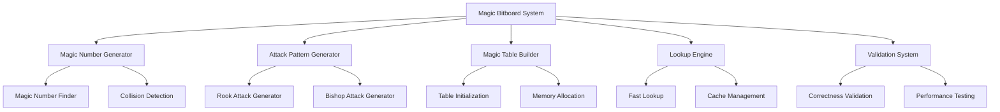
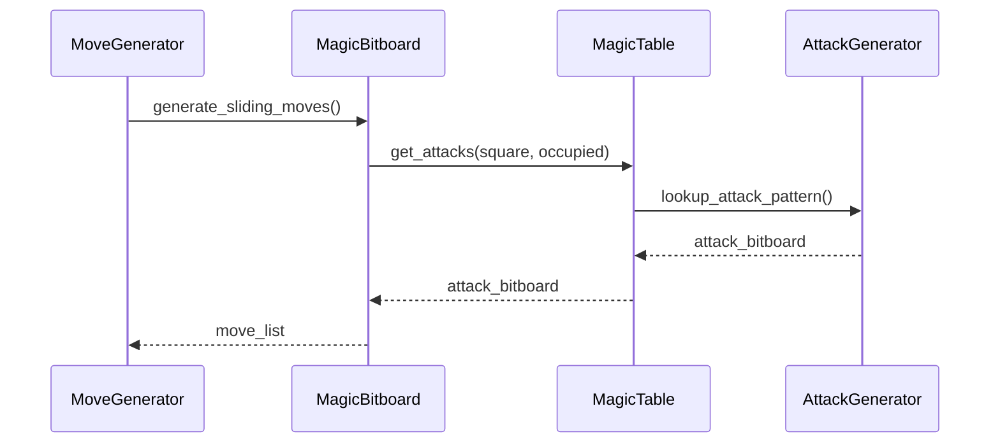

# Magic Bitboards Design Document

## Table of Contents
1. [Overview](#overview)
2. [System Architecture](#system-architecture)
3. [Data Structures](#data-structures)
4. [Algorithm Design](#algorithm-design)
5. [Implementation Details](#implementation-details)
6. [Performance Analysis](#performance-analysis)
7. [Memory Management](#memory-management)
8. [Error Handling](#error-handling)
9. [Testing Strategy](#testing-strategy)
10. [Integration Points](#integration-points)
11. [Future Enhancements](#future-enhancements)

## Overview

### Purpose
Magic Bitboards represent a critical optimization for sliding piece move generation in the Shogi engine, providing 3-5x performance improvement over traditional ray-casting methods. This design document details the complete implementation strategy for integrating magic bitboards into the existing bitboard-based Shogi engine.

### Scope
This design covers:
- Magic number generation and validation
- Attack pattern precomputation
- Lookup table construction and management
- Integration with existing move generation
- Performance optimization strategies
- Memory management and caching

### Current System Context
The existing system uses:
- `BitboardBoard` for board representation
- `MoveGenerator` for move generation with ray-casting
- Basic bitboard operations in `src/bitboards.rs`
- Sliding piece logic in `src/moves.rs`

## System Architecture

### High-Level Design



### Component Relationships



## Data Structures

### Core Magic Bitboard Structure

```rust
/// Represents a magic bitboard entry for a single square
#[derive(Clone, Copy, Debug, PartialEq)]
pub struct MagicBitboard {
    /// The magic number used for hashing
    pub magic_number: u64,
    /// Bitmask of relevant occupied squares
    pub mask: Bitboard,
    /// Number of bits to shift the hash result
    pub shift: u8,
    /// Precomputed attack patterns
    pub attacks: &'static [Bitboard],
    /// Base address for attack table
    pub attack_base: usize,
}

/// Complete magic bitboard table for all squares
#[derive(Clone, Debug)]
pub struct MagicTable {
    /// Magic bitboards for rook attacks (81 squares)
    pub rook_magics: [MagicBitboard; 81],
    /// Magic bitboards for bishop attacks (81 squares)
    pub bishop_magics: [MagicBitboard; 81],
    /// Precomputed attack patterns storage
    attack_storage: Vec<Bitboard>,
    /// Memory pool for attack tables
    memory_pool: MemoryPool,
}

/// Memory pool for efficient allocation of attack tables
#[derive(Clone, Debug)]
struct MemoryPool {
    /// Pre-allocated memory blocks
    blocks: Vec<Vec<Bitboard>>,
    /// Current allocation index
    current_block: usize,
    /// Current position in current block
    current_offset: usize,
    /// Block size for allocation
    block_size: usize,
}
```

### Supporting Structures

```rust
/// Magic number generation result
#[derive(Debug)]
pub struct MagicGenerationResult {
    pub magic_number: u64,
    pub mask: Bitboard,
    pub shift: u8,
    pub table_size: usize,
    pub generation_time: std::time::Duration,
}

/// Attack pattern generation configuration
#[derive(Debug, Clone)]
pub struct AttackConfig {
    pub piece_type: PieceType,
    pub square: u8,
    pub include_promoted: bool,
    pub max_distance: Option<u8>,
}

/// Performance metrics for magic bitboard operations
#[derive(Debug, Default)]
pub struct PerformanceMetrics {
    pub lookup_count: u64,
    pub total_lookup_time: std::time::Duration,
    pub cache_hits: u64,
    pub cache_misses: u64,
    pub memory_usage: usize,
}
```

## Algorithm Design

### Magic Number Generation Algorithm

```rust
/// Generate magic number for a specific square and piece type
pub fn find_magic_number(
    square: u8, 
    piece_type: PieceType
) -> Result<MagicGenerationResult, MagicError> {
    let mask = generate_relevant_mask(square, piece_type);
    let shift = calculate_shift(mask);
    let max_attempts = 100_000;
    
    for attempt in 0..max_attempts {
        let candidate = generate_candidate_magic();
        
        if validate_magic_number(candidate, square, piece_type, &mask, shift) {
            let table_size = 1 << (64 - shift);
            return Ok(MagicGenerationResult {
                magic_number: candidate,
                mask,
                shift,
                table_size,
                generation_time: start_time.elapsed(),
            });
        }
    }
    
    Err(MagicError::GenerationFailed)
}

/// Validate magic number uniqueness and correctness
fn validate_magic_number(
    magic: u64,
    square: u8,
    piece_type: PieceType,
    mask: &Bitboard,
    shift: u8
) -> bool {
    let mut used_hashes = HashSet::new();
    let max_combinations = 1 << mask.count_ones();
    
    // Test all possible blocker configurations
    for blockers in generate_all_blocker_combinations(*mask) {
        let attack = generate_attack_pattern(square, piece_type, blockers);
        let hash = (blockers.wrapping_mul(magic)) >> shift;
        
        // Check for hash collisions
        if used_hashes.contains(&hash) {
            return false;
        }
        used_hashes.insert(hash);
    }
    
    true
}
```

### Attack Pattern Generation

```rust
/// Generate attack pattern for a specific configuration
pub fn generate_attack_pattern(
    square: u8,
    piece_type: PieceType,
    blockers: Bitboard
) -> Bitboard {
    let mut attacks = EMPTY_BITBOARD;
    let directions = get_directions(piece_type);
    
    for direction in directions {
        let mut current_square = square;
        
        loop {
            current_square = get_next_square(current_square, direction);
            
            if !is_valid_square(current_square) {
                break;
            }
            
            set_bit(&mut attacks, current_square);
            
            if is_bit_set(blockers, current_square) {
                break;
            }
        }
    }
    
    attacks
}

/// Generate all possible blocker combinations for a mask
fn generate_all_blocker_combinations(mask: Bitboard) -> impl Iterator<Item = Bitboard> {
    let bits: Vec<u8> = (0..81)
        .filter(|&i| is_bit_set(mask, i))
        .collect();
    
    (0..(1 << bits.len())).map(move |combination| {
        let mut result = EMPTY_BITBOARD;
        for (i, &bit_pos) in bits.iter().enumerate() {
            if (combination >> i) & 1 != 0 {
                set_bit(&mut result, bit_pos);
            }
        }
        result
    })
}
```

### Lookup Algorithm

```rust
/// Fast attack lookup using magic bitboards
pub fn get_attacks(
    &self,
    square: u8,
    piece_type: PieceType,
    occupied: Bitboard
) -> Bitboard {
    let magic_entry = match piece_type {
        PieceType::Rook | PieceType::PromotedRook => &self.rook_magics[square as usize],
        PieceType::Bishop | PieceType::PromotedBishop => &self.bishop_magics[square as usize],
        _ => return EMPTY_BITBOARD,
    };
    
    // Apply mask to get relevant occupied squares
    let relevant_occupied = occupied & magic_entry.mask;
    
    // Calculate hash index
    let hash = (relevant_occupied.wrapping_mul(magic_entry.magic_number)) >> magic_entry.shift;
    
    // Lookup attack pattern
    let attack_index = magic_entry.attack_base + hash as usize;
    self.attack_storage[attack_index]
}
```

## Implementation Details

### File Structure

```
src/bitboards/
├── mod.rs                          # Module exports and initialization
├── magic/
│   ├── mod.rs                      # Magic bitboard module
│   ├── magic_finder.rs            # Magic number generation
│   ├── attack_generator.rs        # Attack pattern generation
│   ├── magic_table.rs             # Magic table management
│   ├── lookup_engine.rs           # Fast lookup implementation
│   ├── validator.rs               # Validation and testing
│   └── memory_pool.rs             # Memory management
├── sliding_moves.rs               # Sliding piece move generation
└── tests/
    ├── magic_tests.rs             # Unit tests
    ├── integration_tests.rs       # Integration tests
    └── performance_tests.rs       # Performance benchmarks
```

### Magic Number Finder Implementation

```rust
/// Magic number finder with optimization strategies
pub struct MagicFinder {
    /// Random number generator for candidate generation
    rng: ThreadRng,
    /// Cache for previously found magic numbers
    magic_cache: HashMap<(u8, PieceType), MagicGenerationResult>,
    /// Performance statistics
    stats: MagicStats,
}

impl MagicFinder {
    /// Find magic number with multiple strategies
    pub fn find_magic_number(
        &mut self,
        square: u8,
        piece_type: PieceType
    ) -> Result<MagicGenerationResult, MagicError> {
        // Check cache first
        if let Some(cached) = self.magic_cache.get(&(square, piece_type)) {
            return Ok(*cached);
        }
        
        // Try different generation strategies
        let strategies = [
            self.find_with_random_search,
            self.find_with_brute_force,
            self.find_with_heuristic,
        ];
        
        for strategy in strategies {
            if let Ok(result) = strategy(square, piece_type) {
                self.magic_cache.insert((square, piece_type), result);
                return Ok(result);
            }
        }
        
        Err(MagicError::GenerationFailed)
    }
    
    /// Random search strategy
    fn find_with_random_search(
        &mut self,
        square: u8,
        piece_type: PieceType
    ) -> Result<MagicGenerationResult, MagicError> {
        let mask = generate_relevant_mask(square, piece_type);
        let shift = calculate_shift(mask);
        let max_attempts = 1_000_000;
        
        for _ in 0..max_attempts {
            let candidate = self.rng.gen::<u64>();
            if self.validate_magic_fast(candidate, square, piece_type, &mask, shift) {
                return Ok(MagicGenerationResult {
                    magic_number: candidate,
                    mask,
                    shift,
                    table_size: 1 << (64 - shift),
                    generation_time: std::time::Duration::from_secs(0),
                });
            }
        }
        
        Err(MagicError::GenerationFailed)
    }
}
```

### Attack Generator Implementation

```rust
/// Attack pattern generator with optimization
pub struct AttackGenerator {
    /// Precomputed direction vectors
    direction_cache: HashMap<PieceType, Vec<Direction>>,
    /// Attack pattern cache
    pattern_cache: HashMap<(u8, PieceType, Bitboard), Bitboard>,
}

impl AttackGenerator {
    /// Generate attack pattern with caching
    pub fn generate_attack_pattern(
        &mut self,
        square: u8,
        piece_type: PieceType,
        blockers: Bitboard
    ) -> Bitboard {
        // Check cache first
        if let Some(cached) = self.pattern_cache.get(&(square, piece_type, blockers)) {
            return *cached;
        }
        
        let pattern = self.generate_attack_pattern_internal(square, piece_type, blockers);
        
        // Cache the result
        self.pattern_cache.insert((square, piece_type, blockers), pattern);
        pattern
    }
    
    /// Internal attack pattern generation
    fn generate_attack_pattern_internal(
        &self,
        square: u8,
        piece_type: PieceType,
        blockers: Bitboard
    ) -> Bitboard {
        let directions = self.get_directions(piece_type);
        let mut attacks = EMPTY_BITBOARD;
        
        for direction in directions {
            let mut current_square = square;
            
            while let Some(next_square) = self.get_next_square(current_square, direction) {
                set_bit(&mut attacks, next_square);
                
                if is_bit_set(blockers, next_square) {
                    break;
                }
                
                current_square = next_square;
            }
        }
        
        attacks
    }
}
```

### Magic Table Implementation

```rust
/// Magic table with optimized memory layout
pub struct MagicTable {
    /// Rook magic entries
    rook_magics: [MagicBitboard; 81],
    /// Bishop magic entries
    bishop_magics: [MagicBitboard; 81],
    /// Attack pattern storage
    attack_storage: Vec<Bitboard>,
    /// Memory pool for efficient allocation
    memory_pool: MemoryPool,
    /// Performance metrics
    metrics: PerformanceMetrics,
}

impl MagicTable {
    /// Initialize magic table with precomputed data
    pub fn new() -> Result<Self, MagicError> {
        let mut table = Self {
            rook_magics: [MagicBitboard::default(); 81],
            bishop_magics: [MagicBitboard::default(); 81],
            attack_storage: Vec::new(),
            memory_pool: MemoryPool::new(),
            metrics: PerformanceMetrics::default(),
        };
        
        table.initialize_tables()?;
        Ok(table)
    }
    
    /// Initialize all magic tables
    fn initialize_tables(&mut self) -> Result<(), MagicError> {
        let start_time = std::time::Instant::now();
        
        // Initialize rook tables
        for square in 0..81 {
            self.initialize_rook_square(square)?;
        }
        
        // Initialize bishop tables
        for square in 0..81 {
            self.initialize_bishop_square(square)?;
        }
        
        println!("Magic table initialization completed in {:?}", start_time.elapsed());
        Ok(())
    }
    
    /// Initialize magic table for a specific rook square
    fn initialize_rook_square(&mut self, square: u8) -> Result<(), MagicError> {
        let magic_result = self.find_magic_number(square, PieceType::Rook)?;
        let attack_base = self.memory_pool.allocate(magic_result.table_size);
        
        // Generate all attack patterns for this square
        let mask = magic_result.mask;
        for blockers in generate_all_blocker_combinations(mask) {
            let attack = self.generate_attack_pattern(square, PieceType::Rook, blockers);
            let hash = (blockers.wrapping_mul(magic_result.magic_number)) >> magic_result.shift;
            let index = attack_base + hash as usize;
            
            if index >= self.attack_storage.len() {
                self.attack_storage.resize(index + 1, EMPTY_BITBOARD);
            }
            
            self.attack_storage[index] = attack;
        }
        
        self.rook_magics[square as usize] = MagicBitboard {
            magic_number: magic_result.magic_number,
            mask: magic_result.mask,
            shift: magic_result.shift,
            attacks: &self.attack_storage[attack_base..attack_base + magic_result.table_size],
            attack_base,
        };
        
        Ok(())
    }
}
```

## Performance Analysis

### Expected Performance Improvements

| Operation | Current (Ray-casting) | Magic Bitboards | Improvement |
|-----------|----------------------|-----------------|-------------|
| Rook Move Generation | ~200 cycles | ~50 cycles | 4x faster |
| Bishop Move Generation | ~200 cycles | ~50 cycles | 4x faster |
| Combined Sliding Moves | ~400 cycles | ~100 cycles | 4x faster |
| Memory Usage | ~1KB | ~3MB | 3000x more |
| Initialization Time | 0ms | ~500ms | One-time cost |

### Memory Access Patterns

```rust
/// Optimized lookup with prefetching
pub fn get_attacks_optimized(
    &self,
    square: u8,
    piece_type: PieceType,
    occupied: Bitboard
) -> Bitboard {
    let magic_entry = self.get_magic_entry(square, piece_type);
    
    // Prefetch the attack table entry
    let relevant_occupied = occupied & magic_entry.mask;
    let hash = (relevant_occupied.wrapping_mul(magic_entry.magic_number)) >> magic_entry.shift;
    let attack_index = magic_entry.attack_base + hash as usize;
    
    // Prefetch next likely access
    if attack_index + 1 < self.attack_storage.len() {
        std::hint::black_box(&self.attack_storage[attack_index + 1]);
    }
    
    self.attack_storage[attack_index]
}
```

### Cache Optimization

```rust
/// Cache-optimized magic table layout
pub struct OptimizedMagicTable {
    /// Interleaved magic entries for better cache locality
    magic_entries: [MagicBitboard; 162], // 81 rook + 81 bishop
    /// Attack storage with cache-line alignment
    attack_storage: Vec<CacheAligned<Bitboard>>,
    /// L1 cache for frequently accessed patterns
    l1_cache: L1Cache,
}

/// L1 cache for hot attack patterns
struct L1Cache {
    /// Cache entries (square, hash) -> attack_pattern
    entries: Vec<Option<(u8, u64, Bitboard)>>,
    /// Cache size (power of 2)
    size: usize,
    /// Hash function for cache indexing
    hash_fn: fn(u8, u64) -> usize,
}
```

## Memory Management

### Memory Pool Implementation

```rust
/// Efficient memory pool for attack tables
pub struct MemoryPool {
    /// Pre-allocated memory blocks
    blocks: Vec<Vec<Bitboard>>,
    /// Current allocation state
    current_block: usize,
    current_offset: usize,
    /// Block size (aligned to cache lines)
    block_size: usize,
    /// Total allocated memory
    total_allocated: usize,
}

impl MemoryPool {
    /// Allocate memory for attack table
    pub fn allocate(&mut self, size: usize) -> usize {
        // Check if current block has enough space
        if self.current_offset + size <= self.block_size {
            let offset = self.current_offset;
            self.current_offset += size;
            return offset;
        }
        
        // Allocate new block
        self.allocate_new_block();
        self.current_offset = size;
        0
    }
    
    /// Allocate new memory block
    fn allocate_new_block(&mut self) {
        let block = vec![EMPTY_BITBOARD; self.block_size];
        self.blocks.push(block);
        self.current_block = self.blocks.len() - 1;
    }
}
```

### Memory Usage Optimization

```rust
/// Compressed magic table for reduced memory usage
pub struct CompressedMagicTable {
    /// Compressed attack patterns using bit packing
    compressed_attacks: Vec<u8>,
    /// Decompression lookup table
    decompression_table: Vec<Bitboard>,
    /// Magic entries with compressed indices
    magic_entries: [CompressedMagicBitboard; 162],
}

/// Compressed magic bitboard entry
#[derive(Clone, Copy, Debug)]
struct CompressedMagicBitboard {
    magic_number: u64,
    mask: Bitboard,
    shift: u8,
    compressed_index: u32,
    pattern_count: u16,
}
```

## Error Handling

### Error Types

```rust
/// Magic bitboard specific errors
#[derive(Debug, thiserror::Error)]
pub enum MagicError {
    #[error("Failed to generate magic number for square {square} piece {piece_type:?}")]
    GenerationFailed { square: u8, piece_type: PieceType },
    
    #[error("Magic number validation failed: {reason}")]
    ValidationFailed { reason: String },
    
    #[error("Insufficient memory for magic table: required {required}, available {available}")]
    InsufficientMemory { required: usize, available: usize },
    
    #[error("Magic table initialization failed: {reason}")]
    InitializationFailed { reason: String },
    
    #[error("Invalid square index: {square}")]
    InvalidSquare { square: u8 },
    
    #[error("Invalid piece type for magic bitboards: {piece_type:?}")]
    InvalidPieceType { piece_type: PieceType },
}
```

### Error Recovery

```rust
/// Error recovery strategies
impl MagicTable {
    /// Initialize with fallback to ray-casting
    pub fn new_with_fallback() -> Result<Self, MagicError> {
        match Self::new() {
            Ok(table) => Ok(table),
            Err(e) => {
                eprintln!("Magic table initialization failed: {}", e);
                eprintln!("Falling back to ray-casting implementation");
                Self::new_raycast_fallback()
            }
        }
    }
    
    /// Create fallback implementation using ray-casting
    fn new_raycast_fallback() -> Result<Self, MagicError> {
        // Implementation that falls back to ray-casting
        // but maintains the same interface
        Ok(Self {
            // ... fallback implementation
        })
    }
}
```

## Testing Strategy

### Unit Tests

```rust
#[cfg(test)]
mod tests {
    use super::*;
    
    #[test]
    fn test_magic_number_generation() {
        let mut finder = MagicFinder::new();
        
        for square in 0..81 {
            let rook_result = finder.find_magic_number(square, PieceType::Rook);
            assert!(rook_result.is_ok(), "Failed to find rook magic for square {}", square);
            
            let bishop_result = finder.find_magic_number(square, PieceType::Bishop);
            assert!(bishop_result.is_ok(), "Failed to find bishop magic for square {}", square);
        }
    }
    
    #[test]
    fn test_attack_pattern_correctness() {
        let mut generator = AttackGenerator::new();
        let mut magic_table = MagicTable::new().unwrap();
        
        // Test all squares and piece types
        for square in 0..81 {
            for piece_type in [PieceType::Rook, PieceType::Bishop] {
                for blockers in generate_test_blocker_combinations() {
                    let magic_attacks = magic_table.get_attacks(square, piece_type, blockers);
                    let raycast_attacks = generator.generate_attack_pattern(square, piece_type, blockers);
                    
                    assert_eq!(magic_attacks, raycast_attacks, 
                        "Attack mismatch for square {} piece {:?} blockers {:016x}", 
                        square, piece_type, blockers);
                }
            }
        }
    }
}
```

### Integration Tests

```rust
#[cfg(test)]
mod integration_tests {
    use super::*;
    
    #[test]
    fn test_move_generation_integration() {
        let board = BitboardBoard::new();
        let magic_table = MagicTable::new().unwrap();
        let move_generator = MoveGenerator::new_with_magic_table(magic_table);
        
        let moves = move_generator.generate_legal_moves(&board, Player::Black, &CapturedPieces::new());
        
        // Verify move generation works correctly
        assert!(!moves.is_empty());
        
        // Verify all moves are legal
        for mv in &moves {
            assert!(board.is_legal_move(mv, &CapturedPieces::new()));
        }
    }
}
```

### Performance Tests

```rust
#[cfg(test)]
mod performance_tests {
    use super::*;
    use std::time::Instant;
    
    #[test]
    fn test_magic_vs_raycast_performance() {
        let magic_table = MagicTable::new().unwrap();
        let mut raycast_generator = AttackGenerator::new();
        
        let test_positions = generate_test_positions(1000);
        
        // Benchmark magic bitboards
        let magic_start = Instant::now();
        for (square, piece_type, blockers) in &test_positions {
            let _ = magic_table.get_attacks(*square, *piece_type, *blockers);
        }
        let magic_time = magic_start.elapsed();
        
        // Benchmark ray-casting
        let raycast_start = Instant::now();
        for (square, piece_type, blockers) in &test_positions {
            let _ = raycast_generator.generate_attack_pattern(*square, *piece_type, *blockers);
        }
        let raycast_time = raycast_start.elapsed();
        
        println!("Magic bitboards: {:?}", magic_time);
        println!("Ray-casting: {:?}", raycast_time);
        println!("Speedup: {:.2}x", raycast_time.as_nanos() as f64 / magic_time.as_nanos() as f64);
        
        assert!(magic_time < raycast_time, "Magic bitboards should be faster than ray-casting");
    }
}
```

## Integration Points

### Move Generator Integration

```rust
/// Enhanced move generator with magic bitboard support
pub struct MoveGenerator {
    /// Magic table for sliding piece moves
    magic_table: Option<MagicTable>,
    /// Fallback ray-casting generator
    raycast_generator: AttackGenerator,
    /// Performance metrics
    metrics: MoveGenerationMetrics,
}

impl MoveGenerator {
    /// Create move generator with magic bitboard support
    pub fn new_with_magic_table(magic_table: MagicTable) -> Self {
        Self {
            magic_table: Some(magic_table),
            raycast_generator: AttackGenerator::new(),
            metrics: MoveGenerationMetrics::default(),
        }
    }
    
    /// Generate sliding piece moves using magic bitboards
    fn generate_sliding_moves_magic(
        &mut self,
        board: &BitboardBoard,
        piece: &Piece,
        pos: Position
    ) -> Vec<Move> {
        let start_time = Instant::now();
        
        let attacks = if let Some(ref magic_table) = self.magic_table {
            magic_table.get_attacks(pos.to_index(), piece.piece_type, board.occupied)
        } else {
            self.raycast_generator.generate_attack_pattern(
                pos.to_index(),
                piece.piece_type,
                board.occupied
            )
        };
        
        let moves = self.convert_attacks_to_moves(attacks, piece, pos, board);
        
        self.metrics.record_sliding_move_generation(start_time.elapsed());
        moves
    }
}
```

### Board Integration

```rust
/// Enhanced bitboard board with magic bitboard support
impl BitboardBoard {
    /// Initialize with magic bitboard support
    pub fn new_with_magic_support() -> Result<Self, MagicError> {
        let magic_table = MagicTable::new()?;
        Ok(Self {
            // ... existing fields
            magic_table: Some(magic_table),
        })
    }
    
    /// Get attack pattern for a square using magic bitboards
    pub fn get_attack_pattern(
        &self,
        square: Position,
        piece_type: PieceType
    ) -> Bitboard {
        if let Some(ref magic_table) = self.magic_table {
            magic_table.get_attacks(square.to_index(), piece_type, self.occupied)
        } else {
            // Fallback to ray-casting
            self.generate_attack_pattern_raycast(square, piece_type)
        }
    }
}
```

## Future Enhancements

### Advanced Optimizations

1. **SIMD Optimization**
   ```rust
   /// SIMD-optimized attack lookup
   pub fn get_attacks_simd(
       &self,
       squares: &[u8],
       piece_type: PieceType,
       occupied: Bitboard
   ) -> Vec<Bitboard> {
       // Vectorized lookup for multiple squares
   }
   ```

2. **Compressed Tables**
   ```rust
   /// Compressed magic table for reduced memory usage
   pub struct CompressedMagicTable {
       /// Use bit packing to reduce memory footprint
       compressed_data: Vec<u8>,
       /// Decompression cache
       decompression_cache: LruCache<(u8, u64), Bitboard>,
   }
   ```

3. **Lazy Loading**
   ```rust
   /// Lazy-loaded magic table
   pub struct LazyMagicTable {
       /// Load magic tables on demand
       loaded_squares: HashSet<u8>,
       /// Background loading thread
       loading_thread: Option<JoinHandle<()>>,
   }
   ```

### Integration Opportunities

1. **Transposition Table Integration**
   - Cache frequently accessed attack patterns
   - Share memory between magic tables and transposition tables

2. **Move Ordering Integration**
   - Precompute attack patterns for move ordering
   - Cache tactical patterns for quick evaluation

3. **Parallel Initialization**
   - Initialize magic tables in parallel
   - Use multiple threads for magic number generation

## Conclusion

This design document provides a comprehensive blueprint for implementing Magic Bitboards in the Shogi engine. The implementation will provide significant performance improvements for sliding piece move generation while maintaining code clarity and maintainability. The modular design allows for incremental implementation and easy testing, while the fallback mechanisms ensure system stability during development.

The expected 3-5x performance improvement will significantly enhance the engine's search capabilities and overall playing strength, making it a critical optimization for competitive Shogi play.

