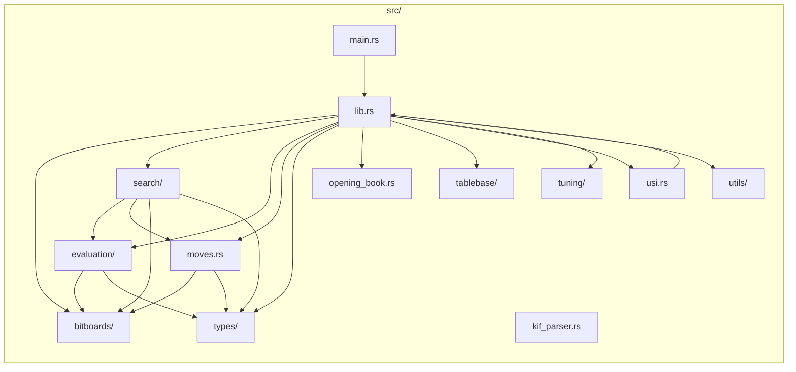
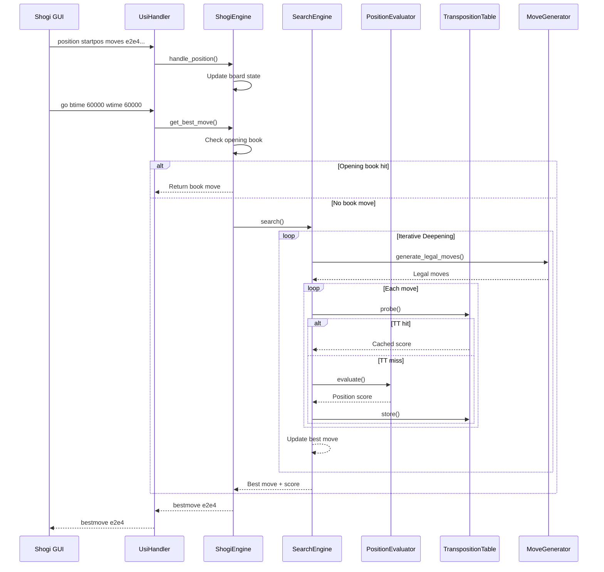
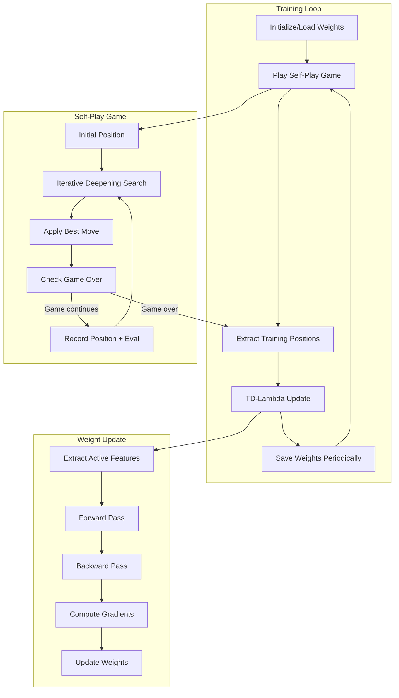
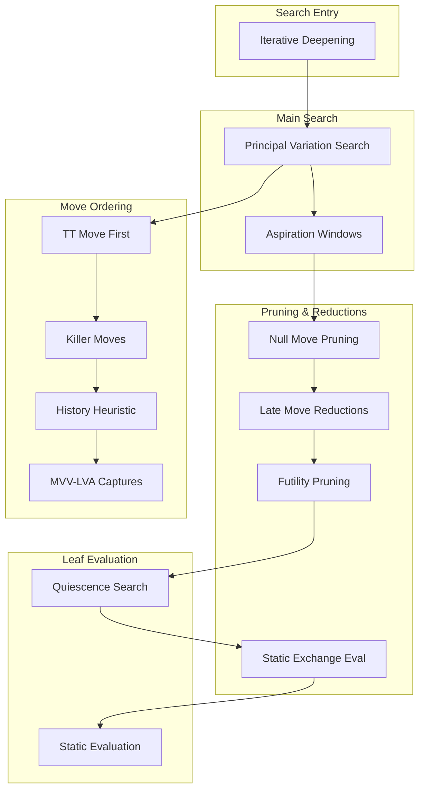
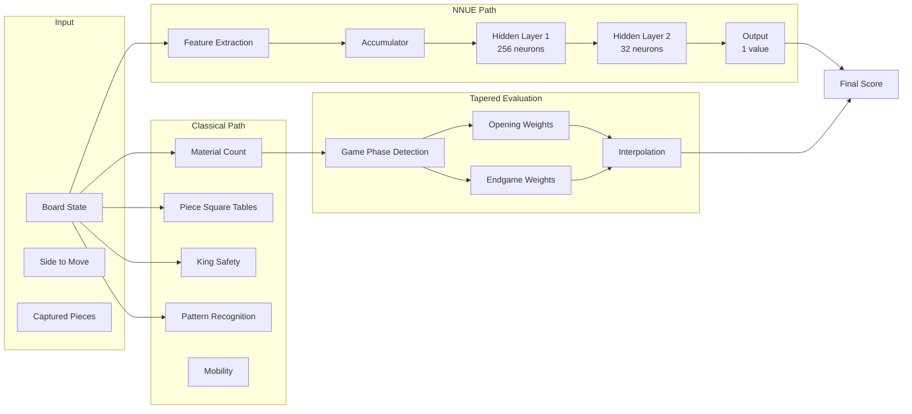
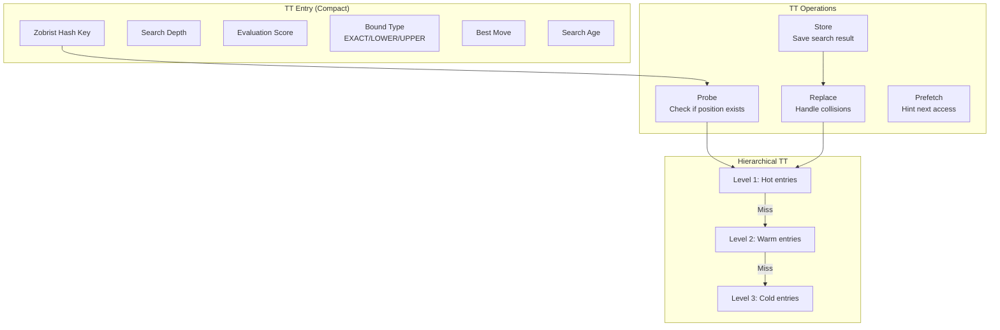
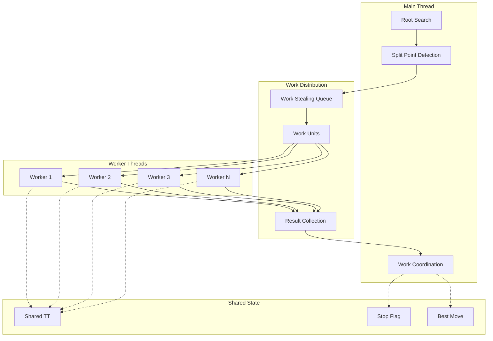

# Shogi Engine Architecture

This document provides a comprehensive overview of the Yggdrasil Shogi Engine architecture for AI agents starting new tasks.

## High-Level Architecture

```mermaid
graph TB
    subgraph "Entry Points"
        USI[usi-engine<br/>Main USI Protocol]
        TUNER[tuner<br/>Evaluation Tuning]
        TRAINER[nnue_trainer<br/>NNUE Self-Play Training]
        ANALYZER[analyzer<br/>Position Analysis]
        TESTER[strength-tester<br/>Engine Testing]
        ASSESSOR[move-assessor<br/>Move Quality Analysis]
        PUZZLE[puzzle-gen<br/>Puzzle Generation]
        MAGIC[generate_magic_tables<br/>Magic Bitboard Gen]
        OPT_MAGIC[optimize_magic_numbers<br/>Magic Optimization]
        PST[pst-tuning-runner<br/>PST Tuning]
    end

    subgraph "Core Engine (lib.rs)"
        ENGINE[ShogiEngine]
        USI_HANDLER[UsiHandler]
    end

    subgraph "Board Representation"
        BITBOARD[BitboardBoard]
        MAGIC_TABLE[MagicTable]
        ZOBRIST[Zobrist Hashing]
    end

    subgraph "Search System"
        SEARCH_ENGINE[SearchEngine]
        ITERATIVE[IterativeDeepening]
        PVS[Principal Variation Search]
        QUIESCENCE[Quiescence Search]
        NULL_MOVE[Null Move Pruning]
        LMR[Late Move Reductions]
        TT[Transposition Table]
        PARALLEL[Parallel Search]
    end

    subgraph "Evaluation System"
        EVALUATOR[PositionEvaluator]
        NNUE[NNUE Network]
        PST_EVAL[Piece Square Tables]
        MATERIAL[Material Evaluation]
        KING_SAFETY[King Safety]
        PATTERNS[Pattern Recognition]
        TAPERED[Tapered Evaluation]
    end

    subgraph "Move Generation"
        MOVE_GEN[MoveGenerator]
        MOVE_ORD[Move Ordering]
        KILLER[Killer Moves]
        HISTORY[History Heuristic]
    end

    subgraph "Support Systems"
        OPENING[Opening Book]
        TABLEBASE[Micro Tablebase]
        TIME_MGR[Time Management]
    end

    USI --> USI_HANDLER
    USI_HANDLER --> ENGINE
    ENGINE --> SEARCH_ENGINE
    ENGINE --> OPENING
    ENGINE --> TABLEBASE
    
    SEARCH_ENGINE --> EVALUATOR
    SEARCH_ENGINE --> MOVE_GEN
    SEARCH_ENGINE --> TT
    SEARCH_ENGINE --> TIME_MGR
    SEARCH_ENGINE --> ITERATIVE
    
    ITERATIVE --> PVS
    PVS --> QUIESCENCE
    PVS --> NULL_MOVE
    PVS --> LMR
    
    EVALUATOR --> NNUE
    EVALUATOR --> PST_EVAL
    EVALUATOR --> MATERIAL
    EVALUATOR --> KING_SAFETY
    EVALUATOR --> PATTERNS
    EVALUATOR --> TAPERED
    
    MOVE_GEN --> BITBOARD
    BITBOARD --> MAGIC_TABLE
    
    MOVE_ORD --> KILLER
    MOVE_ORD --> HISTORY
    
    TT --> ZOBRIST
    
    TRAINER --> ENGINE
    TRAINER --> NNUE
    TUNER --> EVALUATOR
    ANALYZER --> ENGINE
```



## Module Dependency Graph



## Data Flow: Search Request



## NNUE Training Flow



## Search Algorithm Stack



## Evaluation Components



## Bitboard Architecture

```mermaid
flowchart TB
    subgraph "Bitboard Representation"
        BB[Bitboard: u128]
        BB_DESC["9x9 = 81 squares<br/>Fits in 128 bits"]
    end
    
    subgraph "Piece Bitboards"
        BLACK_PAWN[Black Pawns]
        BLACK_LANCE[Black Lances]
        BLACK_KNIGHT[Black Knights]
        BLACK_SILVER[Black Silvers]
        BLACK_GOLD[Black Golds]
        BLACK_BISHOP[Black Bishops]
        BLACK_ROOK[Black Rooks]
        BLACK_KING[Black King]
        WHITE_PIECES[White Pieces...]
    end
    
    subgraph "Magic Bitboards"
        MAGIC_TABLE[Magic Number Table]
        ATTACK_TABLE[Attack Tables]
        BLOCKER_MASK[Blocker Masks]
    end
    
    subgraph "Operations"
        AND[AND - Intersection]
        OR[OR - Union]
        XOR[XOR - Toggle]
        SHIFT[Shift - Movement]
        POPCOUNT[Popcount - Count]
        BITSCAN[Bitscan - Find]
    end
    
    BB --> BLACK_PAWN
    BB --> BLACK_LANCE
    BB --> BLACK_KNIGHT
    BB --> BLACK_SILVER
    BB --> BLACK_GOLD
    BB --> BLACK_BISHOP
    BB --> BLACK_ROOK
    BB --> BLACK_KING
    BB --> WHITE_PIECES
    
    MAGIC_TABLE --> ATTACK_TABLE
    BLOCKER_MASK --> MAGIC_TABLE
    
    BB --> AND
    BB --> OR
    BB --> XOR
    BB --> SHIFT
    BB --> POPCOUNT
    BB --> BITSCAN
```



## Transposition Table Structure



## Parallel Search Architecture



## Key Data Structures

### Position Representation
```
BitboardBoard {
    pieces: [Bitboard; 28]     // 14 piece types x 2 players
    occupied: [Bitboard; 2]    // All pieces per player
    all_occupied: Bitboard     // All pieces combined
}
```

### Move Representation
```
Move {
    from: Option<Position>     // None for drops
    to: Position
    piece_type: PieceType
    player: Player
    is_promotion: bool
    is_capture: bool
    captured_piece: Option<PieceType>
}
```

### Search State
```
SearchEngine {
    evaluator: PositionEvaluator
    transposition_table: TranspositionTable
    killer_moves: [[Move; 2]; MAX_PLY]
    history_table: [[i32; 81]; 28]
    pv_table: PrincipalVariation
}
```

### NNUE Weights
```
NNUEWeights {
    input_weights: Vec<Vec<f32>>     // [768 inputs][256 hidden1]
    hidden1_biases: Vec<f32>         // [256]
    hidden1_to_hidden2: Vec<Vec<f32>>// [256][32]
    hidden2_biases: Vec<f32>         // [32]
    hidden2_to_output: Vec<f32>      // [32]
    output_bias: f32
}
```
