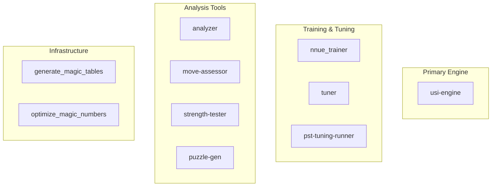
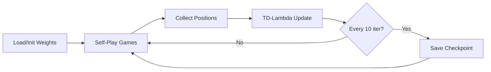

# Shogi Engine Binaries Reference

This document describes all executable binaries in the project, their purposes, and usage patterns.

## Binary Overview



---

## 1. usi-engine (Main Engine)

**Path:** `src/main.rs`  
**Purpose:** The primary Shogi engine implementing the USI (Universal Shogi Interface) protocol.

### Usage
```bash
# Build and run
cargo build --release --bin usi-engine
./target/release/usi-engine

# Test with commands
echo -e "usi\nisready\nposition startpos\ngo depth 5\nquit" | ./target/release/usi-engine
```

### USI Commands Supported
| Command | Description |
|---------|-------------|
| `usi` | Identify engine, list options |
| `isready` | Sync command, returns `readyok` |
| `position startpos [moves ...]` | Set position from start |
| `position sfen <sfen> [moves ...]` | Set position from SFEN |
| `go [btime X wtime Y byoyomi Z]` | Start search |
| `stop` | Stop current search |
| `setoption name X value Y` | Set engine option |
| `usinewgame` | Reset for new game |
| `quit` | Exit engine |

### Key Options
| Option | Type | Default | Description |
|--------|------|---------|-------------|
| `USI_Hash` | spin | 16 | Hash table size in MB |
| `USI_Threads` | spin | (auto) | Number of search threads |
| `MaxDepth` | spin | 0 | Max search depth (0=unlimited) |
| `PSTPreset` | combo | Builtin | PST configuration preset |

### Key Files
- `src/main.rs` - Entry point with panic/signal handlers
- `src/usi.rs` - USI protocol handler
- `src/lib.rs:79-460` - ShogiEngine core implementation

---

## 2. nnue_trainer (NNUE Training)

**Path:** `src/bin/nnue_trainer.rs`  
**Purpose:** Train NNUE neural network weights through self-play using TD(lambda) learning.

### Usage
```bash
# Standard training
cargo run --release --bin nnue_trainer

# Training continues from existing weights if nnue_weights_trained.json exists
```

### Configuration (in code)
```rust
config.games_per_iteration = 30;      // Games per batch
config.iterations = 700;              // Total training iterations
config.learning_rate = 0.005;         // Learning rate
config.lambda = 0.7;                  // TD(lambda) parameter
config.search_depth = 7;              // Self-play search depth
config.time_per_move_ms = 300;        // Time per move
config.max_moves_per_game = 200;      // Max game length
config.min_batch_size = 500;          // Min positions before update
```

### Output Files
| File | Description |
|------|-------------|
| `nnue_weights_trained.json` | Final trained weights |
| `nnue_weights_iter_N.json` | Checkpoint at iteration N |

### Training Flow


---

## 3. tuner (Evaluation Tuning)

**Path:** `src/bin/tuner.rs`  
**Purpose:** Automated evaluation parameter tuning using optimization algorithms.

### Usage
```bash
# Basic tuning
./target/release/tuner --dataset games.json --output weights.json

# With options
./target/release/tuner \
    --dataset games.json \
    --output weights.json \
    --method adam \
    --iterations 1000 \
    -k 5 \
    --verbose

# Cross-validation only
./target/release/tuner --dataset games.json --output weights.json validate --folds 5

# Generate synthetic data
./target/release/tuner --dataset games.json --output weights.json generate --count 1000 --output synthetic.json

# Benchmark algorithms
./target/release/tuner --dataset games.json --output weights.json benchmark --iterations 100
```

### CLI Options
| Option | Short | Default | Description |
|--------|-------|---------|-------------|
| `--dataset` | `-d` | (required) | Training data file |
| `--output` | `-o` | (required) | Output weights file |
| `--method` | `-m` | adam | Optimization method |
| `--iterations` | `-i` | 1000 | Max iterations |
| `--k-fold` | `-k` | 5 | Cross-validation folds |
| `--test-split` | | 0.2 | Test data percentage |
| `--verbose` | `-v` | false | Verbose output |

### Optimization Methods
| Method | Description |
|--------|-------------|
| `gradient-descent` | Simple gradient descent |
| `adam` | Adaptive moment estimation |
| `lbfgs` | Limited-memory BFGS |
| `genetic` | Genetic algorithm |

---

## 4. analyzer (Position Analysis)

**Path:** `src/bin/analyzer.rs`  
**Purpose:** Analyze shogi positions with detailed evaluation.

### Usage
```bash
# Analyze starting position
./target/release/analyzer startpos --depth 8

# Analyze specific SFEN
./target/release/analyzer sfen "lnsgkgsnl/1r5b1/ppppppppp/9/9/9/PPPPPPPPP/1B5R1/LNSGKGSNL b - 1" --depth 6

# Compare positions
./target/release/analyzer compare "sfen1" "sfen2" "sfen3" --depth 5
```

### CLI Options
| Option | Short | Default | Description |
|--------|-------|---------|-------------|
| `--position` | `-p` | | SFEN position |
| `--depth` | `-d` | 6 | Search depth |
| `--time-limit` | `-t` | 5000 | Time limit (ms) |
| `--verbose` | `-v` | false | Verbose output |

---

## 5. strength-tester (Engine Testing)

**Path:** `src/bin/strength-tester.rs`  
**Purpose:** Test engine strength through self-play matches.

### Usage
```bash
# Self-play test
./target/release/strength-tester --games 100 --depth 4 --verbose

# Compare configurations
./target/release/strength-tester compare --config1 config1.json --config2 config2.json

# ELO estimation
./target/release/strength-tester elo --opponent stockfish --games 50
```

### CLI Options
| Option | Short | Default | Description |
|--------|-------|---------|-------------|
| `--time-control` | `-t` | 10+0.1 | Time control |
| `--games` | `-g` | 10 | Number of games |
| `--depth` | `-d` | 2 | Search depth |
| `--verbose` | `-v` | false | Verbose output |

---

## 6. move-assessor (Move Quality Analysis)

**Path:** `src/bin/move_assessor.rs`  
**Purpose:** Analyze game moves for quality, detecting blunders and mistakes.

### Usage
```bash
# Analyze game
./target/release/move-assessor --input game.kif --depth 8

# Find blunders
./target/release/move-assessor --input game.kif find-blunders --threshold 300

# Annotate game
./target/release/move-assessor --input game.kif annotate --output annotated.kif
```

### Move Quality Categories
| Category | Centipawn Loss | Symbol |
|----------|---------------|--------|
| Excellent | < 0 | ! |
| Good | 0-50 | (none) |
| Inaccuracy | 50-100 | ?! |
| Mistake | 100-200 | ? |
| Blunder | > 200 | ?? |

---

## 7. puzzle-gen (Puzzle Generator)

**Path:** `src/bin/puzzle_gen.rs`  
**Purpose:** Generate tactical puzzles from shogi games.

### Usage
```bash
# Extract puzzles
./target/release/puzzle-gen --input games/ --output puzzles.json --count 100

# By pattern
./target/release/puzzle-gen by-pattern --pattern fork --count 50 --output forks.json

# Verify solutions
./target/release/puzzle-gen verify --input puzzles.json
```

### Supported Patterns
- Fork
- Pin
- Skewer
- Discovery
- Sacrifice
- Mate threats

---

## 8. generate_magic_tables

**Path:** `src/bin/generate_magic_tables.rs`  
**Purpose:** Generate magic bitboard lookup tables for sliding piece attacks.

### Usage
```bash
cargo run --release --bin generate_magic_tables
```

### Output
Creates files in `resources/magic_tables/`:
- `rook_magic.bin` - Rook attack tables
- `bishop_magic.bin` - Bishop attack tables
- `lance_magic.bin` - Lance attack tables

---

## 9. optimize_magic_numbers

**Path:** `src/bin/optimize_magic_numbers.rs`  
**Purpose:** Find optimal magic numbers for magic bitboard indexing.

### Usage
```bash
cargo run --release --bin optimize_magic_numbers
```

---

## 10. pst-tuning-runner

**Path:** `src/bin/pst_tuning_runner.rs`  
**Purpose:** Run piece-square table tuning experiments.

### Usage
```bash
cargo run --release --bin pst-tuning-runner
```

---

## Build Commands Summary

```bash
# Build all binaries (release mode)
cargo build --release

# Build specific binary
cargo build --release --bin usi-engine

# Build without SIMD (compatibility mode)
cargo build --release --bin usi-engine --no-default-features --features hierarchical-tt

# Run with cargo
cargo run --release --bin <binary-name> -- <args>
```

## Common Workflows

### 1. Training NNUE from Scratch
```bash
# Remove existing weights
rm -f nnue_weights_*.json

# Run trainer
cargo run --release --bin nnue_trainer
```

### 2. Testing Engine Improvements
```bash
# Run strength test before changes
./target/release/strength-tester --games 100 --depth 4 > before.txt

# Make changes, rebuild
cargo build --release

# Run strength test after changes
./target/release/strength-tester --games 100 --depth 4 > after.txt

# Compare results
diff before.txt after.txt
```

### 3. Analyzing a Game
```bash
# Get move quality assessment
./target/release/move-assessor --input game.kif --depth 8 --output analysis.json

# Generate puzzles from the game
./target/release/puzzle-gen --input game.kif --output puzzles.json
```
