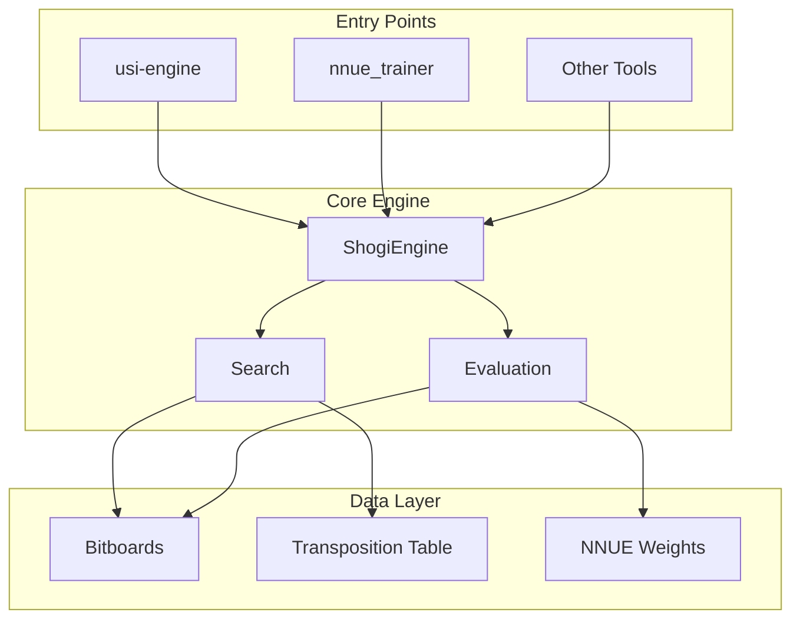

# Shogi Engine Memory Index

This folder contains structured documentation for AI agents working on the Yggdrasil Shogi Engine.

## Documents

| Document | Purpose | Read When |
|----------|---------|-----------|
| [AGENT_QUICKSTART.md](./AGENT_QUICKSTART.md) | Quick reference for common tasks | Starting any task |
| [ARCHITECTURE.md](./ARCHITECTURE.md) | System design with Mermaid diagrams | Understanding system structure |
| [MODULES.md](./MODULES.md) | Detailed module documentation | Working on specific modules |
| [BINARIES.md](./BINARIES.md) | All binary tools and usage | Using or modifying tools |

## Quick Reference

### Project Structure
```
shogi-engine/
├── src/
│   ├── lib.rs          # Core ShogiEngine
│   ├── main.rs         # USI engine entry
│   ├── usi.rs          # USI protocol
│   ├── search/         # Search algorithms
│   ├── evaluation/     # Position evaluation, NNUE
│   ├── bitboards/      # Board representation
│   ├── moves.rs        # Move generation
│   ├── types/          # Core data types
│   └── bin/            # Utility binaries
├── tests/              # Integration tests
├── benches/            # Performance benchmarks
├── config/             # Configuration files
├── resources/          # Magic tables, positions
├── docs/               # Additional documentation
└── memory/             # AI agent documentation (this folder)
```

### Essential Commands
```bash
# Build
cargo build --release

# Test
cargo test

# Run engine
./target/release/usi-engine

# Train NNUE
cargo run --release --bin nnue_trainer
```

### Feature Flags
| Flag | Default | Purpose |
|------|---------|---------|
| `simd` | ON | SIMD optimizations |
| `hierarchical-tt` | ON | Hierarchical TT |
| `statistics` | OFF | Statistics tracking |
| `legacy-tests` | OFF | Legacy benchmarks |

## System Overview Diagram



## Task-Oriented Navigation

### "I want to improve search performance"
1. Read [ARCHITECTURE.md](./ARCHITECTURE.md) - Search Algorithm Stack section
2. Look at `src/search/search_engine.rs`
3. Check `src/search/reductions.rs` for pruning
4. Run benchmarks: `cargo bench --features legacy-tests`

### "I want to improve evaluation accuracy"
1. Read [MODULES.md](./MODULES.md) - Evaluation Module section
2. Look at `src/evaluation/nnue.rs` for NNUE
3. Run trainer: `cargo run --release --bin nnue_trainer`

### "I want to add a new USI option"
1. Read [AGENT_QUICKSTART.md](./AGENT_QUICKSTART.md) - Adding USI Option
2. Modify `src/usi.rs` and `src/lib.rs`

### "I want to fix a bug in move generation"
1. Look at `src/moves.rs` for MoveGenerator
2. Check `src/bitboards/` for board operations
3. Run tests: `cargo test`

### "I want to understand the NNUE training"
1. Read [ARCHITECTURE.md](./ARCHITECTURE.md) - NNUE Training Flow
2. Look at `src/bin/nnue_trainer.rs`
3. Look at `src/evaluation/nnue_training.rs`

## Key Constants

| Constant | Value | Location |
|----------|-------|----------|
| Board size | 9x9 (81 squares) | Throughout |
| Bitboard type | u128 | `src/types/` |
| NNUE hidden 1 | 256 | `src/evaluation/nnue.rs` |
| NNUE hidden 2 | 32 | `src/evaluation/nnue.rs` |
| Default TT size | 16 MB | `src/lib.rs` |
| Max search depth | 100 | `src/lib.rs` |

## Important Invariants

1. **Move legality** - All moves returned by `generate_legal_moves()` must be legal
2. **King safety** - No move should leave own king in check
3. **Drop rules** - Pawns cannot be dropped on last rank, no two pawns on same file
4. **Promotion** - Pieces entering/leaving promotion zone can promote
5. **Captured pieces** - Demote on capture, available for drops

## External Resources

- **USI Protocol:** Universal Shogi Interface specification
- **Shogi Rules:** Japanese Chess rules and piece movements
- **NNUE:** Efficiently Updatable Neural Network architecture
- **Magic Bitboards:** Perfect hashing for sliding piece attacks
