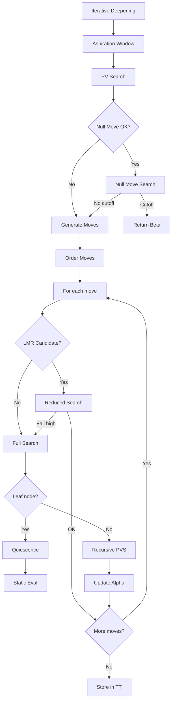

# Shogi Engine Modules Reference

This document provides detailed information about each module in the engine for AI agents.

## Module Structure Overview

```
src/
├── lib.rs              # Main library entry, ShogiEngine struct
├── main.rs             # USI engine entry point
├── usi.rs              # USI protocol implementation
├── bitboards/          # Bitboard representation & operations
├── search/             # Search algorithms & transposition tables
├── evaluation/         # Position evaluation & NNUE
├── moves.rs            # Move generation
├── types/              # Core data types
├── tuning/             # Evaluation tuning infrastructure
├── opening_book.rs     # Opening book support
├── tablebase/          # Endgame tablebases
├── kif_parser.rs       # KIF game notation parser
├── utils/              # Utilities & telemetry
├── config/             # Configuration management
├── time_utils.rs       # Time management helpers
└── bin/                # Binary entry points
```

---

## Core Modules

### lib.rs (Engine Core)

**Location:** `src/lib.rs`

**Key Struct:** `ShogiEngine` (lines 78-94)

```rust
pub struct ShogiEngine {
    board: BitboardBoard,
    captured_pieces: CapturedPieces,
    current_player: Player,
    opening_book: OpeningBook,
    tablebase: MicroTablebase,
    stop_flag: Arc<AtomicBool>,
    search_engine: Arc<Mutex<SearchEngine>>,
    depth: u8,
    thread_count: usize,
    parallel_options: ParallelOptions,
    pst_config: PieceSquareTableConfig,
}
```

**Key Methods:**
| Method | Line | Description |
|--------|------|-------------|
| `new()` | 97-138 | Initialize engine with defaults |
| `get_best_move()` | 477-779 | Find best move for position |
| `apply_move()` | 782-849 | Apply move to internal board |
| `is_game_over()` | 852-879 | Check for checkmate/stalemate |
| `handle_position()` | 881-984 | Process USI position command |

**Re-exports:**
- `BitboardBoard` from bitboards
- Evaluation modules: `king_safety`, `castles`, `attacks`, `patterns`

---

### usi.rs (USI Protocol)

**Location:** `src/usi.rs`

**Key Struct:** `UsiHandler`

**Commands Handled:**
| Command | Handler | Line |
|---------|---------|------|
| `usi` | `handle_usi()` | 134-200+ |
| `isready` | `handle_isready()` | - |
| `position` | `engine.handle_position()` | 29 |
| `go` | `handle_go()` | 41-132 |
| `stop` | `engine.handle_stop()` | 31 |
| `setoption` | `engine.handle_setoption()` | 33 |

---

## Bitboards Module (`src/bitboards/`)

**Purpose:** Efficient board representation using 128-bit integers.

### Key Files

| File | Purpose |
|------|---------|
| `mod.rs` (bitboards.rs) | Main exports, BitboardBoard struct |
| `magic/` | Magic bitboard implementation |
| `simd.rs` | SIMD-optimized operations |
| `bitscan.rs` | Bit scanning operations |
| `popcount.rs` | Population count functions |
| `masks.rs` | File/rank/diagonal masks |
| `attack_patterns.rs` | Attack pattern generation |
| `batch_ops.rs` | Batch bitboard operations |

### BitboardBoard Struct

**Location:** `src/bitboards.rs` (implicit from mod.rs)

**Key Operations:**
| Method | Description |
|--------|-------------|
| `new()` | Create initial position |
| `empty()` | Create empty board |
| `from_fen()` | Parse SFEN string |
| `to_fen()` | Generate SFEN string |
| `get_piece()` | Get piece at position |
| `place_piece()` | Place piece on board |
| `make_move()` | Apply move, return captured |
| `is_king_in_check()` | Check detection |
| `get_attacks()` | Get attack bitboard |

### Magic Bitboards

**Location:** `src/bitboards/magic/`

Used for fast sliding piece (rook, bishop, lance) attack generation.

```rust
// Get rook attacks
let attacks = magic_table.get_rook_attacks(square, blockers);

// Get bishop attacks  
let attacks = magic_table.get_bishop_attacks(square, blockers);
```

### SIMD Operations

**Location:** `src/bitboards/simd.rs`

Requires `simd` feature flag. Provides vectorized operations:
- Parallel popcount
- Batch AND/OR/XOR
- Parallel bit scanning

---

## Search Module (`src/search/`)

**Purpose:** Tree search algorithms and supporting data structures.

### Key Files

| File | Purpose | Lines |
|------|---------|-------|
| `search_engine.rs` | Main SearchEngine struct | ~2000 |
| `iterative_deepening.rs` | ID framework | ~500 |
| `pvs.rs` | Principal Variation Search | ~800 |
| `quiescence.rs` | Quiescence search | ~400 |
| `null_move.rs` | Null move pruning | ~300 |
| `reductions.rs` | LMR, futility pruning | ~500 |
| `transposition_table.rs` | TT implementation | ~600 |
| `zobrist.rs` | Zobrist hashing | ~200 |
| `parallel_search.rs` | Multi-threaded search | ~800 |
| `time_management.rs` | Time control | ~400 |
| `move_ordering/` | Move ordering heuristics | ~2000 |

### SearchEngine Struct

**Key Components:**
```rust
pub struct SearchEngine {
    evaluator: PositionEvaluator,
    transposition_table: TranspositionTable,
    killer_moves: KillerMoveTable,
    history_table: HistoryTable,
    config: EngineConfig,
    parallel_options: ParallelOptions,
}
```

### Search Algorithm Flow



### Move Ordering

**Location:** `src/search/move_ordering/`

Priority order:
1. TT move (hash move)
2. Winning captures (MVV-LVA)
3. Killer moves (2 per ply)
4. Counter moves
5. History heuristic
6. Quiet moves

### Transposition Table

**Location:** `src/search/transposition_table.rs`

Entry structure:
```rust
struct TTEntry {
    key: u64,           // Zobrist hash verification
    depth: u8,          // Search depth
    score: i16,         // Evaluation score
    bound: Bound,       // EXACT, LOWER, UPPER
    best_move: Move,    // Best move found
    age: u8,            // Search generation
}
```

---

## Evaluation Module (`src/evaluation/`)

**Purpose:** Position evaluation including NNUE neural network.

### Key Files

| File | Purpose |
|------|---------|
| `mod.rs` | PositionEvaluator struct |
| `nnue.rs` | NNUE network implementation |
| `nnue_training.rs` | NNUE training infrastructure |
| `material.rs` | Material counting |
| `piece_square_tables.rs` | PST evaluation |
| `king_safety.rs` | King safety evaluation |
| `patterns.rs` | Pattern recognition |
| `tapered_eval.rs` | Opening/endgame interpolation |
| `attacks.rs` | Attack/defense patterns |
| `tactical_patterns.rs` | Tactical motif detection |

### PositionEvaluator

**Key Methods:**
```rust
impl PositionEvaluator {
    pub fn evaluate(&self, board: &BitboardBoard, player: Player, 
                    captured: &CapturedPieces) -> i32;
    
    pub fn enable_nnue_with_weights(&mut self, path: &str) -> Result<()>;
    
    pub fn is_nnue_enabled(&self) -> bool;
}
```

### NNUE Architecture

**Location:** `src/evaluation/nnue.rs`

```
Input Layer:  768 features (64 squares x 12 piece types OR 81 x ~8 for Shogi)
Hidden 1:     256 neurons (ClippedReLU)
Hidden 2:     32 neurons (ClippedReLU)  
Output:       1 value (linear)
```

**Feature Encoding:**
- Piece type on each square
- Perspective-relative (from side-to-move view)

### NNUE Training

**Location:** `src/evaluation/nnue_training.rs`

**Key Structs:**
```rust
pub struct NNUETrainer {
    weights: NNUEWeights,
    config: NNUETrainingConfig,
    training_buffer: Vec<TrainingPosition>,
    stats: TrainingStats,
}

pub struct TrainingPosition {
    active_features: Vec<usize>,
    accumulator: NNUEAccumulator,
    evaluation: i32,
    player: Player,
    td_target: Option<f32>,
}
```

### Tapered Evaluation

**Location:** `src/evaluation/tapered_eval.rs`

Interpolates between opening and endgame evaluation based on material:

```rust
let phase = calculate_game_phase(board);  // 0.0 (opening) to 1.0 (endgame)
let score = opening_score * (1.0 - phase) + endgame_score * phase;
```

---

## Types Module (`src/types/`)

**Purpose:** Core data type definitions.

### Key Files

| File | Key Types |
|------|-----------|
| `core.rs` | `Position`, `Piece`, `PieceType`, `Player`, `Move` |
| `board.rs` | `CapturedPieces`, `GamePhase` |
| `search.rs` | `SearchResult`, `Bound`, `Score` |
| `evaluation.rs` | `EvalScore`, `EvalFeatures` |
| `transposition.rs` | `TTEntry`, `TTBound` |
| `patterns.rs` | Pattern-related types |

### Core Types

```rust
pub struct Position {
    pub row: u8,  // 0-8
    pub col: u8,  // 0-8
}

pub enum PieceType {
    King, Rook, Bishop, Gold, Silver, Knight, Lance, Pawn,
    PromotedRook, PromotedBishop, PromotedSilver, 
    PromotedKnight, PromotedLance, PromotedPawn,
}

pub enum Player {
    Black,  // Sente (first mover)
    White,  // Gote
}

pub struct Move {
    pub from: Option<Position>,  // None for drops
    pub to: Position,
    pub piece_type: PieceType,
    pub player: Player,
    pub is_promotion: bool,
    pub is_capture: bool,
    pub captured_piece: Option<PieceType>,
}
```

---

## Moves Module

**Location:** `src/moves.rs`

### MoveGenerator

```rust
impl MoveGenerator {
    pub fn generate_legal_moves(&self, board: &BitboardBoard, 
                                 player: Player,
                                 captured: &CapturedPieces) -> Vec<Move>;
    
    pub fn generate_captures(&self, board: &BitboardBoard,
                              player: Player) -> Vec<Move>;
    
    pub fn generate_checks(&self, board: &BitboardBoard,
                            player: Player) -> Vec<Move>;
}
```

---

## Opening Book Module

**Location:** `src/opening_book.rs`

### OpeningBook Struct

```rust
impl OpeningBook {
    pub fn load_from_json(&mut self, json: &str) -> Result<()>;
    pub fn load_from_binary(&mut self, data: &[u8]) -> Result<()>;
    pub fn get_moves(&self, fen: &str) -> Option<Vec<BookMove>>;
    pub fn get_best_move(&self, fen: &str) -> Option<Move>;
    pub fn get_random_move(&self, fen: &str) -> Option<Move>;
}
```

**Book Format (JSON):**
```json
{
  "positions": {
    "startpos_fen": [
      {"move": "7g7f", "weight": 100, "evaluation": 50},
      {"move": "2g2f", "weight": 80, "evaluation": 40}
    ]
  }
}
```

---

## Tablebase Module

**Location:** `src/tablebase/`

Micro-tablebase for simple endgames (KvK, KRvK, etc.)

```rust
impl MicroTablebase {
    pub fn probe(&self, board: &BitboardBoard, player: Player,
                 captured: &CapturedPieces) -> Option<TablebaseResult>;
}
```

---

## Tuning Module (`src/tuning/`)

**Purpose:** Infrastructure for automated parameter tuning.

### Key Files

| File | Purpose |
|------|---------|
| `optimizer.rs` | Optimization algorithms |
| `validator.rs` | Cross-validation |
| `data_processor.rs` | Training data processing |
| `types.rs` | Tuning configuration types |

### Optimization Methods

```rust
pub enum OptimizationMethod {
    GradientDescent { learning_rate: f64 },
    Adam { learning_rate: f64, beta1: f64, beta2: f64, epsilon: f64 },
    LBFGS { memory_size: usize, max_iterations: usize, ... },
    GeneticAlgorithm { population_size: usize, mutation_rate: f64, ... },
}
```

---

## Utils Module (`src/utils/`)

### Telemetry

```rust
pub fn debug_log(msg: &str);
pub fn trace_log(context: &str, msg: &str);
pub fn set_debug_enabled(enabled: bool);
pub fn is_debug_enabled() -> bool;
```

---

## Config Module (`src/config/`)

Engine configuration management with JSON/YAML/TOML support.

---

## Feature Flags

| Flag | Default | Description |
|------|---------|-------------|
| `simd` | ON | SIMD optimizations |
| `hierarchical-tt` | ON | Hierarchical transposition table |
| `statistics` | OFF | Statistics tracking |
| `verbose-debug` | OFF | Verbose debug logging |
| `tt-prefetch` | OFF | TT prefetching hints |
| `legacy-tests` | OFF | Legacy benchmark tests |
| `material_fast_loop` | OFF | Fast material evaluation |

---

## Module Interaction Patterns

### Search calls Evaluation
```rust
// In search
let score = self.evaluator.evaluate(&board, player, &captured);
```

### Search uses Move Generation
```rust
let mut move_gen = MoveGenerator::new();
let moves = move_gen.generate_legal_moves(&board, player, &captured);
```

### Search queries Transposition Table
```rust
if let Some(entry) = self.tt.probe(hash) {
    if entry.depth >= depth && entry.bound == Bound::Exact {
        return entry.score;
    }
}
```

### NNUE Accumulator Update
```rust
// Incremental update on move
accumulator.update_move(from, to, piece, captured, &weights);

// Full refresh
accumulator.refresh(&board, &weights);
```
