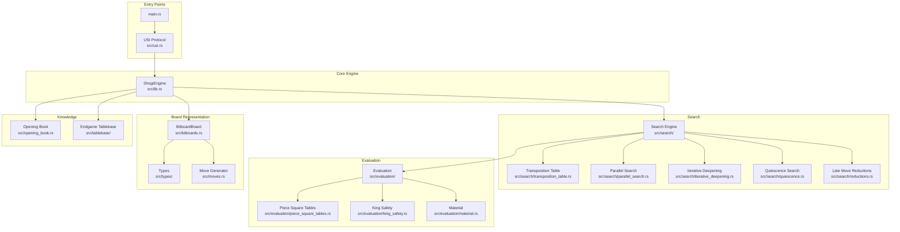
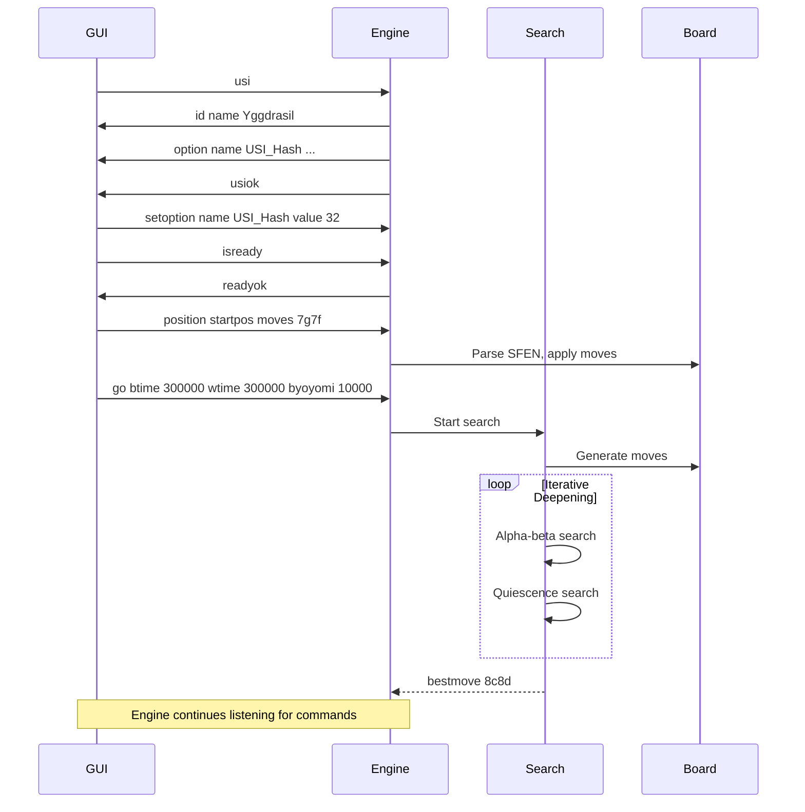

# Shogi Engine Agent Memory

## Project Overview

This is **Yggdrasil**, a high-performance Shogi (Japanese chess) engine written in Rust. It implements the USI (Universal Shogi Interface) protocol for integration with shogi GUIs and supports advanced chess engine features like parallel search, transposition tables, opening books, and endgame tablebases.

**Repository Root**: `/Users/fgantt/projects/vibe/shogi-game/yse`

## Quick Start

```bash
# Build the engine
cargo build --release --bin usi-engine

# Run as USI engine (communicates via stdin/stdout)
./target/release/usi-engine

# Run tests
cargo test

# Run benchmarks
cargo bench
```

## Architecture Overview



## Binary Entry Points

| Binary | Path | Purpose |
|--------|------|---------|
| `usi-engine` | `src/main.rs` | Main USI engine process |
| `tuner` | `src/bin/tuner.rs` | Evaluation weight tuning |
| `analyzer` | `src/bin/analyzer.rs` | Position analysis tool |
| `strength-tester` | `src/bin/strength-tester.rs` | Engine strength testing |
| `move-assessor` | `src/bin/move_assessor.rs` | Move quality assessment |
| `puzzle-gen` | `src/bin/puzzle_gen.rs` | Puzzle generation |
| `pst-tuning-runner` | `src/bin/pst_tuning_runner.rs` | PST parameter tuning |
| `generate_magic_tables` | `src/bin/generate_magic_tables.rs` | Generate magic bitboard tables |
| `optimize_magic_numbers` | `src/bin/optimize_magic_numbers.rs` | Optimize magic number generation |

## Key Modules

### Core Types (`src/types/`)
- `core.rs` - Player, PieceType, Position, Piece, Move definitions
- `board.rs` - Board representation
- `transposition.rs` - Transposition table types
- `search.rs` - Search-related types
- `evaluation.rs` - Evaluation types

### Board Representation (`src/bitboards.rs`)
- Bitboard-based board for efficient move generation and attack detection
- Magic bitboard implementation for sliding piece moves

### Move Generation (`src/moves.rs`)
- Legal move generation
- Pseudo-legal move generation
- Move validation and legality checking

### Search Engine (`src/search/`)
- **Iterative Deepening**: Time-controlled iterative deepening search
- **Transposition Table**: Hierarchical transposition table with multiple replacement policies
- **Parallel Search**: YBWC (Young Brothers Wait Cluster) parallel search
- **Quiescence Search**: Captures and promotions only search to evaluate positions
- **Late Move Reductions (LMR)**: Search reduction heuristics
- **Null Move Pruning**: R+1 search with null move verification
- **Internal Iterative Deepening (IID)**: Enhanced move ordering
- **Aspiration Windows**: Focused search around expected scores

### Evaluation (`src/evaluation/`)
- **Material**: Piece value evaluation
- **Piece Square Tables (PST)**: Position-dependent values with tapered evaluation
- **King Safety**: King attack detection and shelter evaluation
- **Patterns**: Common position pattern recognition
- **Castles**: Castle position evaluation
- **Evaluation Cache**: Cached evaluation results

### Opening Book (`src/opening_book.rs`)
- JSON-based opening book loading
- Binary opening book support
- TT prefill from opening book

### Endgame Tablebase (`src/tablebase/`)
- Micro tablebase for common endgame positions
- Pattern-based endgame detection
- Distance-to-mate queries

### USI Protocol (`src/usi.rs`)
- Standard USI commands: `usi`, `isready`, `position`, `go`, `stop`, `ponderhit`
- Custom options: `USI_Hash`, `PSTPreset`, `MaxDepth`, thread/parallel settings

## USI Protocol Flow



## Configuration Files

| Path | Purpose |
|------|---------|
| `config/pst/default.json` | Default piece square table values |
| `config/opening_book/default_weights.json` | Opening book move weights |
| `resources/material/*.json` | Material value configurations |
| `resources/benchmark_positions/*.json` | Standard positions for testing |

## Features

### Search Features
- [x] Iterative deepening with time management
- [x] Transposition table (hierarchical, multi-level)
- [x] Parallel search with YBWC
- [x] Quiescence search
- [x] Late Move Reductions (LMR)
- [x] Null Move Pruning with verification
- [x] Internal Iterative Deepening (IID)
- [x] Aspiration windows
- [x] Singular move detection
- [x] Null window search (PVS)

### Evaluation Features
- [x] Tapered evaluation (opening/endgame interpolation)
- [x] Material evaluation
- [x] Piece square tables (PST)
- [x] King safety evaluation
- [x] Castle evaluation
- [x] Pattern recognition
- [x] Mobility evaluation
- [x] Pawn structure analysis
- [x] Evaluation caching

### Performance Features
- [x] SIMD optimizations (AVX2, SSE, NEON)
- [x] Magic bitboards for sliding pieces
- [x] Evaluation cache
- [x] Move ordering (MVV-LVA, killers, history)
- [x] Prefetching hints

### Knowledge Features
- [x] Opening book (JSON/binary)
- [x] Opening book TT prefill
- [x] Endgame tablebase (micro)
- [x] Endgame pattern detection

## Build Features (Cargo Features)

```toml
[features]
default = ["hierarchical-tt", "simd"]
verbose-debug = []       # Enable debug logging
statistics = []          # Track statistics
tt-prefetch = []        # Transposition table prefetching
legacy-tests = []       # Legacy unit tests
legacy-examples = []    # Legacy examples
hierarchical-tt = []    # Hierarchical transposition table
material_fast_loop = [] # Fast material evaluation
simd = []               # SIMD optimizations
```

## Common Development Tasks

### Running Tests
```bash
cargo test --lib                    # Library tests
cargo test --test integration        # Integration tests
cargo test --features legacy-tests   # With legacy tests
```

### Running Benchmarks
```bash
cargo bench --features legacy-tests,simd
```

### Building Release
```bash
cargo build --release --bin usi-engine
```

### Code Formatting & Linting
```bash
cargo fmt --check
cargo clippy --all-targets --all-features
```

## Data Structures

### Position Representation
- **9x9 Board**: Row 0 = rank 9 (top), Row 8 = rank 1 (bottom)
- **SFEN Format**: Standard position notation
- **Bitboards**: Separate bitboards for each piece type and player

### Move Representation
- **From/To**: Source and destination squares
- **Piece Type**: Original piece type
- **Promotion**: Boolean flag
- **Drop**: Option for drop moves (from=None)

### Evaluation Score
- **Centipawns**: Integer representation (1 pawn = 100)
- **Mate scores**: Large values for checkmate detection
- **Tapered**: Opening and endgame scores interpolated by game phase

## Documentation

- `docs/` - Design documents and implementation guides
- `docs/design/` - Architecture and design decisions
- `docs/api/` - API references
- `docs/tuning/` - Parameter tuning guides
- `docs/performance/` - Performance analysis guides

## Dependencies

Key external dependencies (from Cargo.toml):
- `rayon` - Parallel iteration
- `serde` - Serialization/deserialization
- `rand` - Random number generation
- `clap` - CLI argument parsing
- `parking_lot` - Fast mutex implementation
- `crossbeam-deque` - Work-stealing deque for parallel search
- `smallvec` - Stack-allocated vectors
