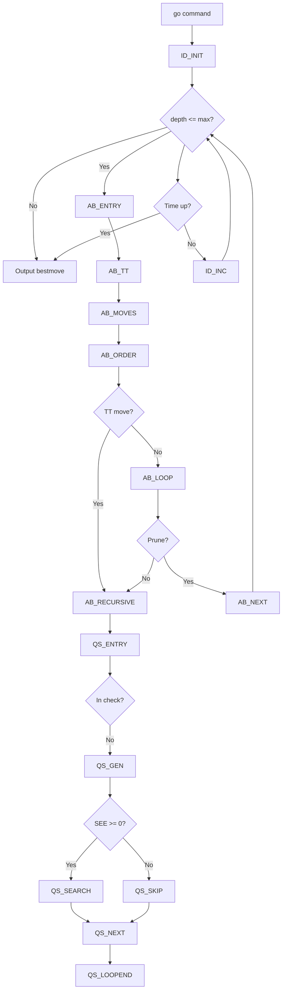
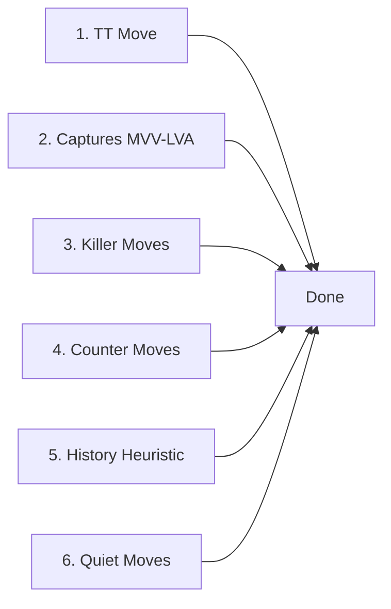
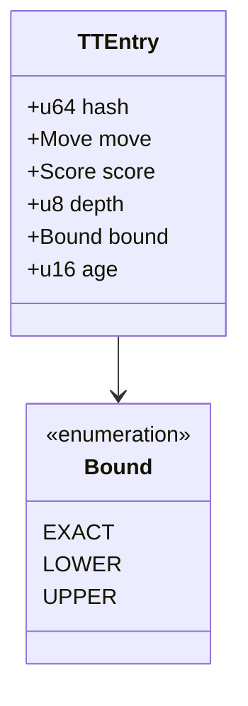
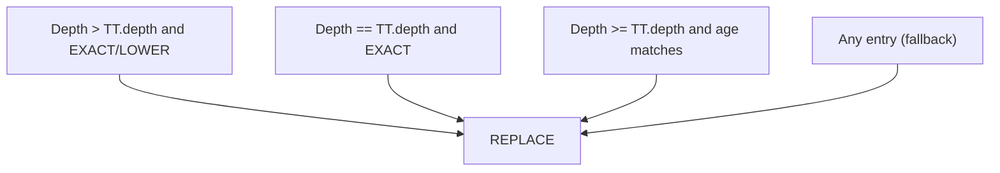
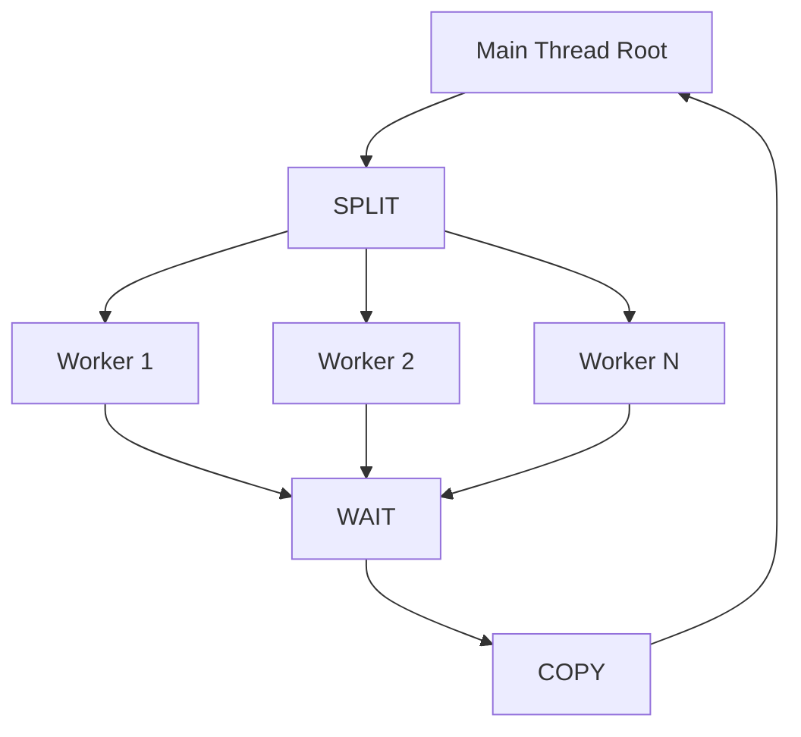
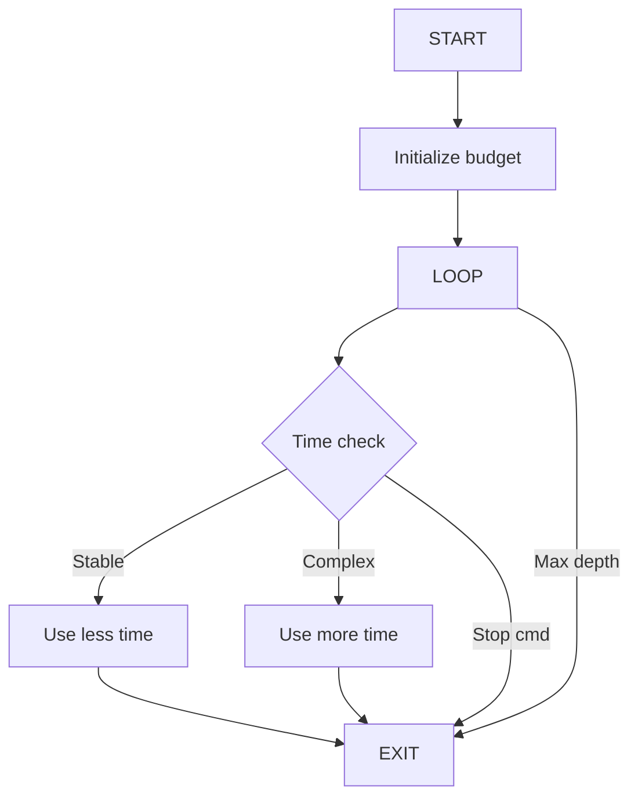

# Search Algorithm Architecture

## Overview

The engine uses a **principal variation search** with **iterative deepening**, combining multiple optimization techniques for efficient game tree exploration.

## Search Flow



## Move Ordering



## Alpha-Beta Search Pseudocode

```
function alphaBeta(depth, alpha, beta, player):
    if depth == 0:
        return quiescence(alpha, beta)
    
    if terminal position:
        return evaluate()
    
    ttEntry = transpositionTable.probe()
    if ttEntry valid and ttEntry.depth >= depth:
        return ttEntry.score (with bound handling)
    
    moves = generateMoves()
    orderMoves(moves, ttEntry.move)
    
    bestMove = null
    for each move in moves:
        if shouldReduce(move, depth):
            score = -alphaBeta(depth - reduction - 1, alpha, beta)
        else:
            score = -alphaBeta(depth - 1, alpha, beta)
        
        if isPVSNode():
            score = -pvs(depth - 1, alpha, alpha + 1)
        
        if score > alpha:
            alpha = score
            bestMove = move
        
        if alpha >= beta:
            updateKiller(move)
            updateHistory(move)
            break
    
    transpositionTable.store(bestMove, alpha, depth)
    return alpha
```

## Transposition Table Structure



## Replacement Policy



## Parallel Search (YBWC)



## Time Management



## Key Search Parameters

| Parameter | Default | Description |
|-----------|---------|-------------|
| `MaxDepth` | 0 (unlimited) | Maximum search depth |
| `USI_Hash` | 16 MB | Transposition table size |
| `USI_Threads` | CPU count | Parallel search threads |
| `AspirationWindowSize` | 25 cp | Initial window size |
| `LMR_min_depth` | 3 | Minimum depth for LMR |
| `LMR_base_reduction` | 1 | Base reduction value |
| `NullMove_min_depth` | 3 | Minimum depth for NMP |
| `NullMove_verification` | true | Use verification search |
| `YBWC_min_depth` | 4 | Minimum depth for split |

## Features by Module

| Module | Features |
|--------|----------|
| `transposition_table.rs` | Hierarchical TT, ML replacement, age-based eviction |
| `parallel_search.rs` | YBWC, work stealing, thread-safe TT |
| `iterative_deepening.rs` | Aspiration windows, time management |
| `quiescence.rs` | SEE pruning, delta pruning, check extensions |
| `reductions.rs` | LMR, history-based reduction, singular move |
| `null_move.rs` | R+1 search, verification, dynamic R |
| `pvs.rs` | Principal variation search, null window |
| `move_ordering/` | MVV-LVA, killers, history, counter moves |
