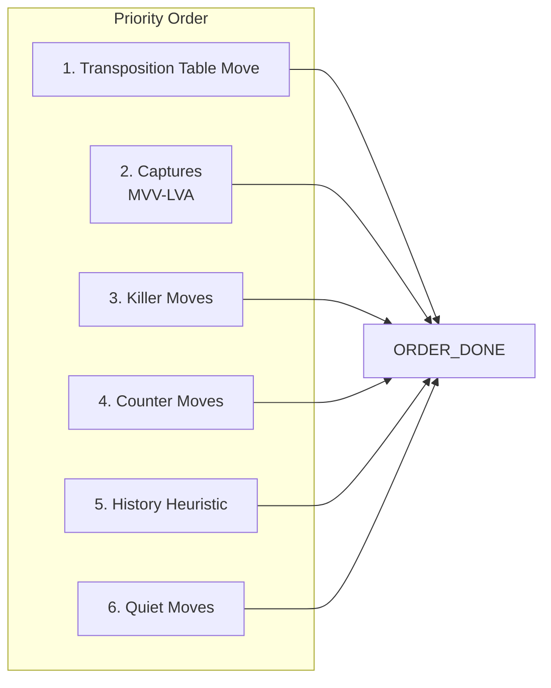
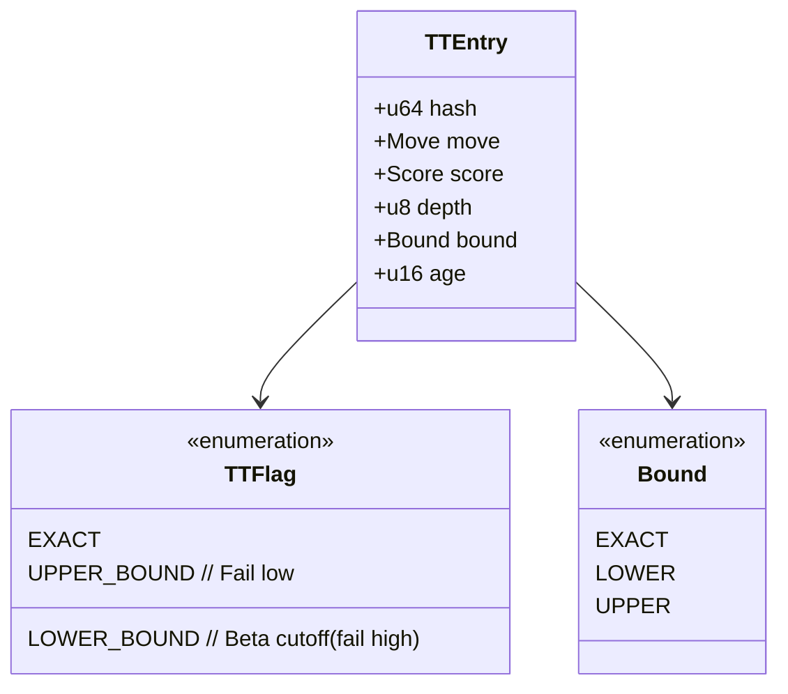
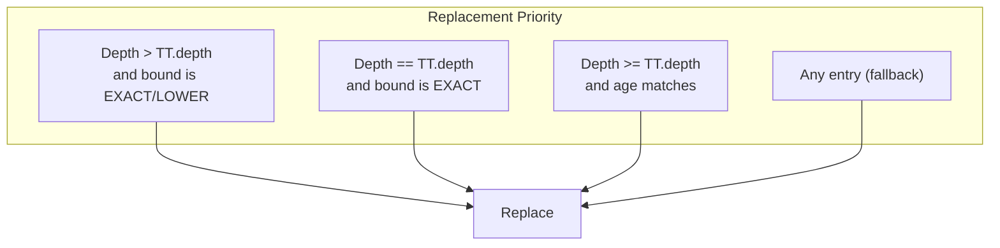
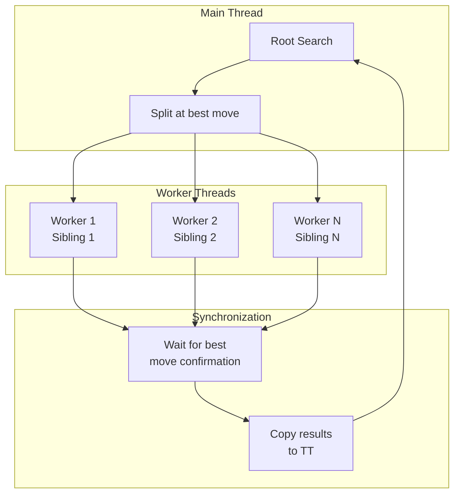
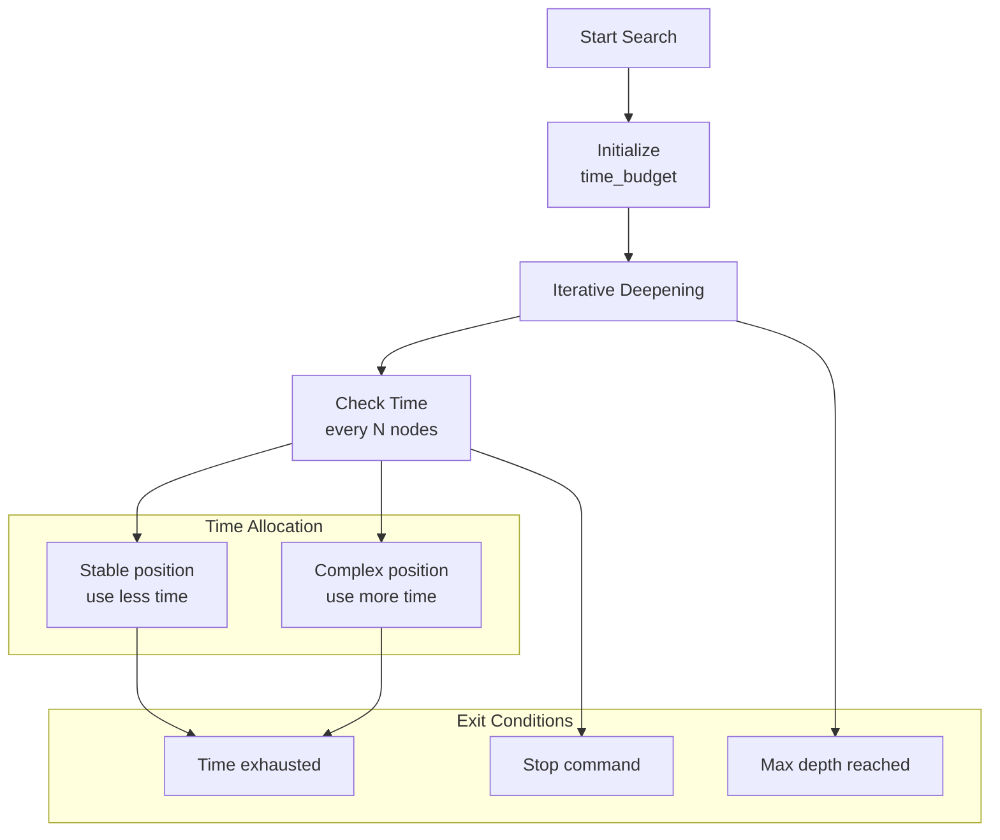

# Search Algorithm Architecture

## Overview

The engine uses a **principal variation search** with **iterative deepening**, combining multiple optimization techniques for efficient game tree exploration.

## Search Flow

```mermaid
flowchart TD
    subgraph "Entry"
        GO["go command<br/>time={btime,wtime,byoyomi}"]
    end
    
    subgraph "Iterative Deepening Loop"
        ID_INIT["Initialize<br/>depth=1"]
        ID_CHECK["depth ≤ max_depth?"]
        ID_SEARCH["Alpha-Beta Search<br/>depth"]
        ID_CHECK_TIME["Time up?"]
        ID_UPDATE["Update best move<br/>Adjust aspiration window"]
        ID_INC["depth += 1"]
    end
    
    subgraph "Alpha-Beta Search"
        AB_ENTRY["Alpha-Beta<br/>alpha, beta, depth"]
        AB_TT["TT Probe"]
        AB_MOVES["Generate Moves"]
        AB_ORDER["Move Ordering"]
        AB_TTMOVE["TT Move<br/>First?"]
        AB_RECURSIVE["Search Move<br/>(PVS/LMR)"]
        AB_UPDATE["Update alpha<br/>Record to TT"]
        AB_PRUNE["Prune remaining?"]
    end
    
    subgraph "Quiescence Search"
        QS_ENTRY["Quiescence<br/>stand_pat = eval"]
        QS_CHECK["In check?"]
        QS_GEN["Generate Captures<br/>+ Promotions"]
        QS_SEE["SEE ≥ 0?"]
        QS_SEARCH["Delta/See Pruning"]
    end
    
    subgraph "Components"
        LMR["Late Move Reduction<br/>reduce(move_num, depth)"]
        NMP["Null Move Pruning<br/>R+1 search"]
        IID["Internal IID<br/>when TT fails"]
        PVS["PVS<br/>null window for non-PV"]
    end
    
    GO → ID_INIT
    ID_INIT → ID_CHECK
    ID_CHECK -- Yes --> AB_ENTRY
    ID_CHECK -- No --> ID_DONE["Output bestmove"]
    AB_ENTRY --> AB_TT
    AB_TT --> AB_MOVES
    AB_MOVES --> AB_ORDER
    AB_ORDER --> AB_TTMOVE
    AB_TTMOVE -- Yes --> AB_RECURSIVE
    AB_TTMOVE -- No --> AB_LOOP["Loop moves"]
    AB_LOOP --> AB_PRUNE
    AB_PRUNE -- No --> AB_RECURSIVE
    AB_PRUNE -- Yes --> AB_NEXT["Next move"]
    AB_RECURSIVE --> LMR
    AB_RECURSIVE --> NMP
    AB_RECURSIVE --> PVS
    AB_RECURSIVE --> IID
    AB_RECURSIVE --> QS_ENTRY
    QS_ENTRY --> QS_CHECK
    QS_CHECK -- No --> QS_GEN
    QS_CHECK -- Yes --> QS_SEARCH
    QS_GEN --> QS_SEE
    QS_SEE -- Yes --> QS_SEARCH
    QS_SEE -- No --> QS_SKIP["Skip move"]
    QS_SEARCH --> QS_NEXT["Next move"]
    AB_NEXT --> ID_CHECK
    ID_CHECK --> ID_CHECK_TIME
    ID_CHECK_TIME -- No --> ID_INC
    ID_CHECK_TIME -- Yes --> ID_DONE
    ID_INC --> ID_CHECK
    QS_SKIP --> QS_NEXT
```

## Move Ordering



## Alpha-Beta Search Pseudocode

```
function alphaBeta(depth, alpha, beta, player):
    if depth == 0:
        return quiescence(alpha, beta)
    
    if terminal position:
        return evaluate()
    
    ttEntry = transpositionTable.probe()
    if ttEntry valid and ttEntry.depth >= depth:
        return ttEntry.score (with bound handling)
    
    moves = generateMoves()
    orderMoves(moves, ttEntry.move)
    
    bestMove = null
    for each move in moves:
        // Late Move Reduction
        if shouldReduce(move, depth):
            score = -alphaBeta(depth - reduction - 1, alpha, beta)
        else:
            score = -alphaBeta(depth - 1, alpha, beta)
        
        // PVS for non-PV nodes
        if isPVSNode():
            score = -pvs(depth - 1, alpha, alpha + 1)
        
        if score > alpha:
            alpha = score
            bestMove = move
        
        if alpha >= beta:
            // Beta cutoff
            updateKiller(move)
            updateHistory(move)
            break
    
    transpositionTable.store(bestMove, alpha, depth)
    return alpha
```

## Transposition Table Structure



## Replacement Policy



## Parallel Search (YBWC)



## Time Management



## Key Search Parameters

| Parameter | Default | Description |
|-----------|---------|-------------|
| `MaxDepth` | 0 (unlimited) | Maximum search depth |
| `USI_Hash` | 16 MB | Transposition table size |
| `USI_Threads` | CPU count | Parallel search threads |
| `AspirationWindowSize` | 25 cp | Initial window size |
| `LMR_min_depth` | 3 | Minimum depth for LMR |
| `LMR_base_reduction` | 1 | Base reduction value |
| `NullMove_min_depth` | 3 | Minimum depth for NMP |
| `NullMove_verification` | true | Use verification search |
| `YBWC_min_depth` | 4 | Minimum depth for split |

## Features by Module

| Module | Features |
|--------|----------|
| `transposition_table.rs` | Hierarchical TT, ML replacement, age-based eviction |
| `parallel_search.rs` | YBWC, work stealing, thread-safe TT |
| `iterative_deepening.rs` | Aspiration windows, time management |
| `quiescence.rs` | SEE pruning, delta pruning, check extensions |
| `reductions.rs` | LMR, history-based reduction, singular move |
| `null_move.rs` | R+1 search, verification, dynamic R |
| `pvs.rs` | Principal variation search, null window |
| `move_ordering/` | MVV-LVA, killers, history, counter moves |
